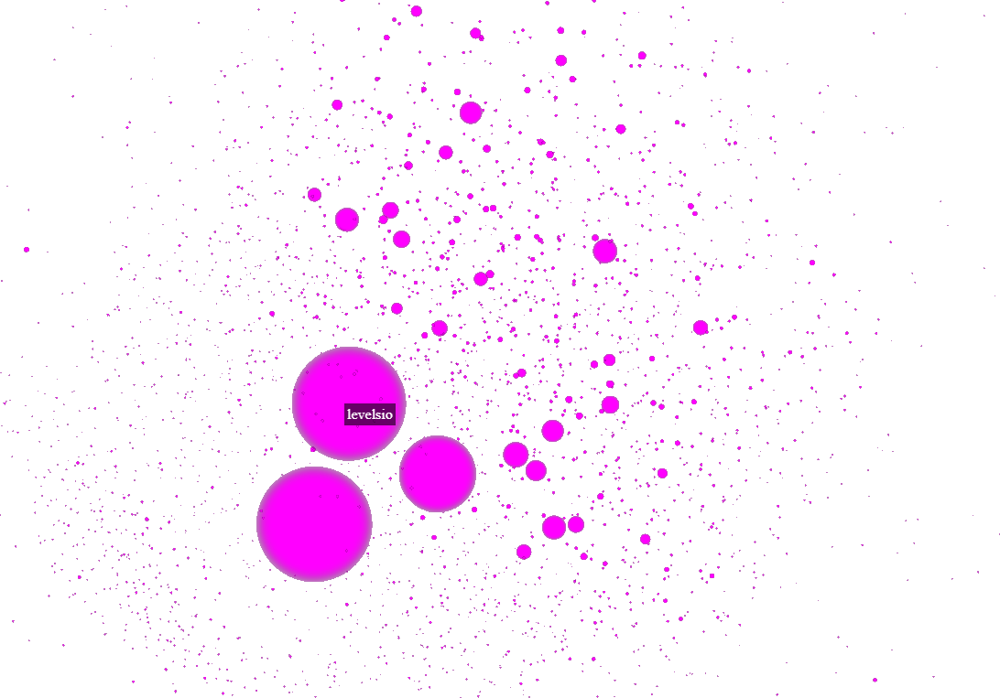

# NomadList user graph

A tiny experiment with:

- a Scala backend relying on Akka-streams to be reactive
- a JS front-end (webpack'ed) using `ngraph` and `Three` to render a network graph in the browser

The result:



This picture doesn't show the links between the users, because it fulfills the screen otherwise!

## How to

- Build the bundle:

```
$ webpack
```

- Start `FetchNomadUsers` to create `nomads.json` in `front-end`
    - This fetch all the users on nomadlist.com recursively to get their relations: following/followers
    - It takes some time
- Open `index.html` on an http server
- Move with WASD through the graph
- Enjoy?

## Would be nice if

- The picture of the users were used
- The graph was static
- We could represent the links in a non-obstrusive way


